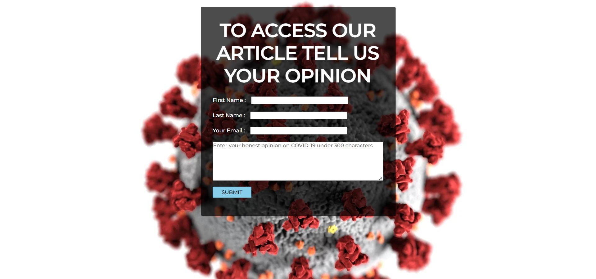

# NLP_PROJECT-Product-Marketing-Using-Customer-Sentiments

Product Marketing Using Customer Sentiments is a prototype project in which we are using NLP Bidirectional GRU to understand the sentiment of the individual who is going to read our article and based on the result which is generated by our model we are going to show them the ads. Our model can do multi-class sentiment analysis i.e it can identify that the person has a Positive sentiment, Negative sentiment, or Neutral sentiment with an accuracy of 85%. For this project, if the person has Positive sentiment we are going to show them an ad for Pwiggy a Food delivery company, if a person has Negative sentiment we will recommend them Dr. Stiven Lawrence who is a psychologist, and if the sentiment is Neutral we will recommend them a hand sanitizer company named NuValu. The data which is used is Tweets of people regarding corona.

# WebApplicationLink:

https://nlpproductmarketing.herokuapp.com/

# Project Type:
Sentiment Analysis

# Domain Targeted:
Marketing & Ads

# Technologies Used:
- Python
- Anaconda Jupyter Notebook
- PyCharm
- HTML/CSS/JS
- Tensorflow
- HeroKu

# Project Look

